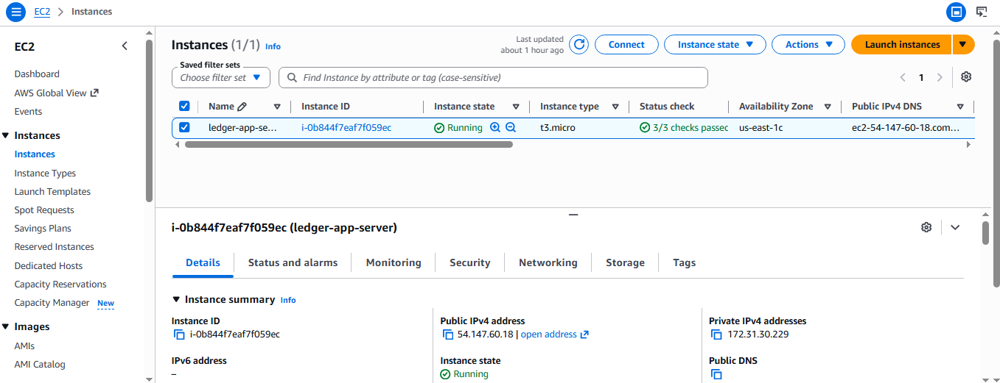
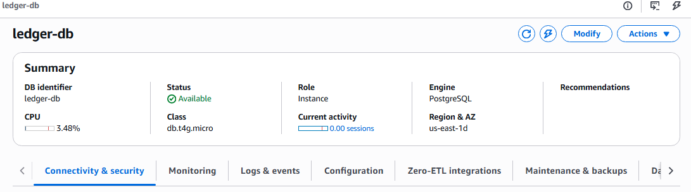
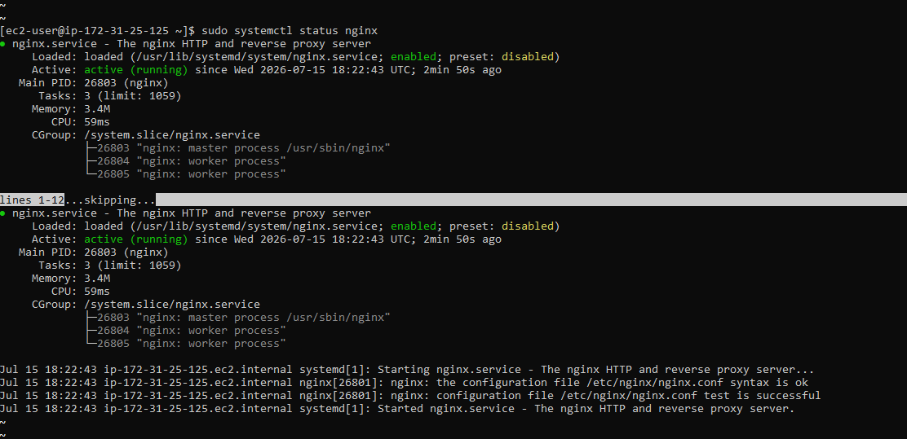
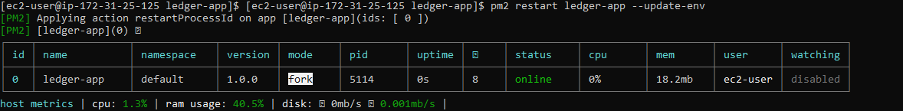
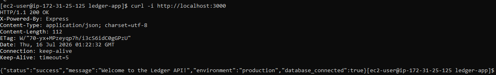

# Ledger Core API

A production-ready, cloud-native REST API designed to handle secure ledger transactions. Built with Node.js and Express, the application is deployed on a highly scalable AWS infrastructure featuring an Amazon EC2 web server and a dedicated Amazon RDS PostgreSQL database.

---

## 🏗️ System Architecture

The application is deployed securely within Amazon Web Services (AWS). Traffic flows from the client through internet protocols directly to our application tier, which securely queries our data tier inside isolated subnets.

```text
       [ Client / Postman / curl ]
                   │ (HTTP / Port 80)
                   ▼
     ┌─────────────────────────────┐
     │          AWS VPC            │
     │  ┌───────────────────────┐  │
     │  │     EC2 Instance      │  │
     │  │ ┌───────────────────┐ │  │
     │  │ │    Nginx Proxy    │ │  │
     │  │ └─────────┬─────────┘ │  │
     │  │           │ (Port 3000)  │
     │  │ ┌─────────▼─────────┐ │  │
     │  │ │ Node.js Express   │ │  │
     │  │ │ managed by PM2    │ │  │
     │  │ └─────────┬─────────┘ │  │
     │  └───────────┼───────────┘  │
     │              │ (PostgreSQL Port 5432)
     │  ┌───────────▼───────────┐  │
     │  │     Amazon RDS        │  │
     │  │   PostgreSQL DB       │  │
     │  └───────────────────────┘  │
     └─────────────────────────────┘
💼 Business Impact & Use Case
In financial technology, data integrity and system availability are non-negotiable. A ledger system requires strict consistency, high availability, and durable backups.

By deploying this API with a decoupled architecture:

Separation of Concerns: Running the application logic on EC2 and the data storage on RDS ensures that high API traffic spikes do not starve the database of compute resources.

Data Durability: Utilizing AWS RDS PostgreSQL provides automated backups, point-in-time recovery, and effortless scalability compared to self-hosting database files.

Cost Efficiency: Transitioned infrastructure from continuous active states to dynamic, on-demand cycles, establishing strict monitoring alerts to avoid cloud resource leakage.

🛠️ Skills Demonstrated
Cloud Infrastructure & Architecture: Hands-on provisioning, configuration, and teardown of Amazon EC2 and Amazon RDS.

Security & Network Configuration: Configuring security groups, defining inbound/outbound traffic parameters, and securing access via environment-driven (.env) credential isolation.

Production Process Management: Implementing PM2 for process monitoring, automated crash recovery, and runtime logging.

Database Management: Structuring relational data utilizing PostgreSQL and establishing dynamic connection pools from a remote server.

System Observability: Utilizing remote Linux commands (pm2 logs, system diagnostic commands) to debug connectivity, network routing, and host metrics.

⚠️ Technical Challenges & Systematic Troubleshooting
1. The Placeholder Endpoint Trap (ENOTFOUND)
What I Observed: I initially suspected a security group or firewall block was preventing the connection, until I inspected the active logs and discovered a getaddrinfo ENOTFOUND error.

The Troubleshooting Process: I recognized that ENOTFOUND is a DNS resolution failure, meaning the server was trying to look up an address that did not exist. Checking the environment configuration revealed that the application was still targeting a generic placeholder database URL (your-rds-endpoint-goes-here.rds.amazonaws.com).

The Fix: I retrieved the active database instance endpoint from the Amazon RDS Console, opened the .env file on the EC2 instance using the nano text editor, and swapped out the placeholder for the live endpoint. This resolved the routing lookup immediately.

🧠 Lessons Learned
1. Decoupling Configuration from Code (The Password Issue)
What Happened: "When the database connection returned false, I realized the code itself was fine, but my configuration wasn't registering correctly with RDS."

The Lesson: I learned the importance of separating configuration from application logic. Using .env files allows us to change credentials without touching the code, but it also means a single syntax typo or incorrect variable name can cleanly break a connection. Checking the runtime logs (pm2 logs) is the fastest way to verify if the issue is a network block or a credential mismatch.

2. The Reality of Remote Server Management (The SSH Timeout)
What Happened: "I got booted out of the server mid-edit because I was inactive in the terminal while working in the AWS browser console."

The Lesson: Working on a remote cloud server (EC2) is fundamentally different from working locally. Remote servers enforce strict security timeouts (SSH keep-alive limits) to prevent idle connections from staying open. I learned how to recover from sudden disconnects, reconnect using SSH keys, and navigate back to my environment quickly.


---

## 📷 System Verification & Screenshots

Below is the visual verification of the operational infrastructure, services, and successful deployment tests.

### AWS Cloud Infrastructure Status
Here are the active, running instances for both our application host and our database in the AWS console.

**Amazon EC2 Instance Dashboard:**


**Amazon RDS Database Instance Status:**


---

### Process Monitoring & API Success Tests
With the infrastructure active, these screenshots verify that Nginx is acting as our web gateway, PM2 is managing our application process, and our API is successfully connecting directly to our RDS instance.

**Nginx Gateway Active:**


**PM2 Daemon Status:**


**API Database Connection Success:**
